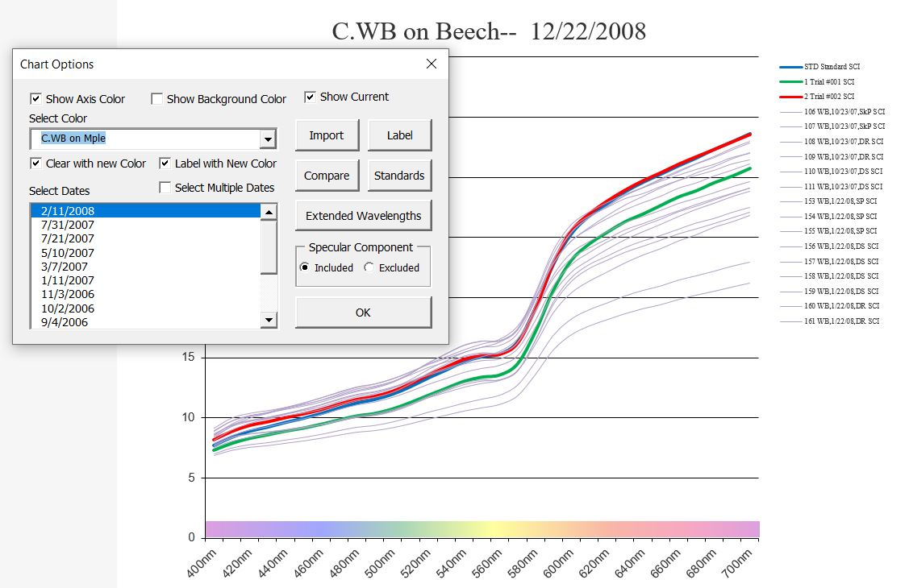
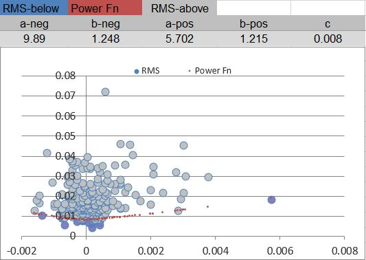

# StainColorQualityControl

## Introduction
This file contains descriptions and code samples of a Visual Basic Windows application I built for a cabinet manufacturer based in Arizona to help them maintain consistency in their stain colors with other component manufacturers. The application maintained a library of hundreds of stain colors spanning multiple years. It imported readings taken from a spectrophotometer and compared them to a standard in order to keep production on track. It was important to allow for considerable variation as naturally occurs in products like wood. Therefore a standard was actually a collection of separate readings which met certain statistical requirements.

## My Role
I was the sole developer of this project and worked on it, off-and-on along with several other manufacturing systems for the same company, for about five years or so. In this capacity, not only did I write the code for this project, I also identified the need, engineered the solution, gathered the necessary equipment (spectrophotometers), and implemented the solution.

## Contents
Sample Components
1. [Routine to Build Chart for Comparing Current Trial to Standard](#routine-to-build-chart-for-comparing-current-trial-to-standard)
2. [ColorCombo_Change Event Handler](#colorcombo_change-event-handler)
3. [DatesLB_KeyDown Event Handler](#dateslb_keydown-event-handler)
4. [Create New Standard](#create-new-standard)
5. [Reading Class](#reading-class) Instances of this class represent a spectrophotometer reading.
6. [ReadingSet Class](#readingset-class) Instances of this class represent a collection of spectrophotometer readings such as a standard or a collection of readings used to create a standard.

## Routine to Build Chart for Comparing Current Trial to Standard
This routine retrieves a trial reading from the spectrophotometer (a collection of reflectance percentages vs. wavelengths of light). It then retrieves the standard from a database of historical data and displays a chart which compares the two.

    Public Sub RebuildChart()
        Dim k As Integer, i As Integer, npts As Integer
        Dim c As Range
        Dim spm As Series 'spectrophotometric
        Dim cs As ColorSet
        Dim r As Reading
        Dim crs As New ReadingSet 'chart reading set
        Dim RS As ReadingSet
        Dim SCIb As Boolean, Extb As Boolean
        Dim LowLambda As Long, HighLambda As Long

        On Error GoTo Problem
        ChartPage.HideTrialMeasureBox
        Application.ScreenUpdating = False
        Application.Calculation = xlCalculationManual
        Application.EnableEvents = False

        SCIb = SCIOB.Value
        Extb = ExtendedTB.Value
        If ShowCurrentCB.Value Then
            With TrialSet
                .ColorName = "Trial"
                .ColorDate = "Today"
                .GetTrialReadings
                If SCIb Then .SCMode = SCI Else .SCMode = SCE
                Set RS = .SCModeSet
                For k = 1 To RS.Readings.Count
                    crs.Readings.Add RS.Readings(k)
                Next k
            End With
        End If
        For i = 1 To ColorSets.Count
            Set cs = ColorSets(i)
            With cs
                If SCIb Then .SCMode = SCI Else .SCMode = SCE
                Set RS = .SCModeSet
                For k = 1 To RS.Readings.Count
                    crs.Readings.Add RS.Readings(k)
                Next k
            End With
        Next i
        If crs.Readings.Count = 0 Then Exit Sub
        crs.GetLambdas LowLambda, HighLambda
        If Extb Then
            If LowLambda >= 400 Or HighLambda <= 700 Then _
                MsgBox "Extended wavelengths are not available for this color. To view them, select that option in OnColor and re-export."
        Else
            If LowLambda < 400 Or HighLambda > 700 Then
                LowLambda = 400
                HighLambda = 700
            End If
        End If
        npts = ((HighLambda - LowLambda) \ 10) + 1
        With ChartDataSheet
            .Cells.Clear
            For i = 0 To npts - 1
                .Cells(i + 4).Value = (LowLambda + i * 10) & "nm"
            Next i
            Set c = .Range("A2")
            For i = 1 To crs.Readings.Count
                Set r = crs.Readings(i)
                r.PlacePartHeaderInRange c
                r.PlacePartPtsInRange c.offset(0, 3), (LowLambda - r.StartLambda) \ 10
                Set c = c.offset(1, 0)
            Next i
        End With
        With ChartPage
            .SetSourceData Source:=ChartDataSheet.Range("A2").CurrentRegion, PlotBy:=xlRows
            With .SeriesCollection
                For i = 1 To crs.Readings.Count
                    Set spm = .Item(i)
                    Set r = crs.Readings(i)
                    r.SetSeries Line:=spm
                Next i
            End With
        End With
        Set crs = Nothing
        Application.ScreenUpdating = True
        Application.Calculation = xlCalculationAutomatic
        Application.EnableEvents = True
        Exit Sub

    Problem:
        ResetApp
        Err.Raise Err.Number
    End Sub

*jump to: [Contents](#contents)*

## ColorCombo_Change Event Handler
This event handler for a ComboBox searched the database of historical data for color readings which matched the selected color and then populated a ListBox of matching colors grouped by date.

    Private Sub ColorCombo_Change()
        Dim ColorName As String, ColorDate As String, PrevColorDate As String, temp As String
        Dim i As Long, j As Long, k As Long, n As Long, m As Long
        Dim l As Range
        Dim cs As ColorSet, cs2 As ColorSet
        Dim AlreadyIn As Boolean

        If Not SkipEvents Then
        If Not ColorCombo.MatchFound Then
            SkipEvents = True
            DatesLB.Clear
            SkipEvents = False
        Else
            SkipEvents = True
            If ClearWithNewColorCB.Value And ClearColorSet Then
                For j = ColorSets.Count To 1 Step -1
                    ColorSets.Remove (j)
                Next j
            End If
            With DatesLB
                .Clear
                n = DispColorSets.Count
                For k = n To 1 Step -1
                    DispColorSets.Remove (k)
                Next k
                ColorName = ColorCombo.Text
                Dim block As Range
                Set block = GetColorRange(ColorName)
                n = block.Rows.Count
                PrevColorDate = ""
                m = 0
                For k = n To 1 Step -1 'so that dates appear most recent first
                    Set l = block.Rows(k)
                    ColorDate = l.Cells(2).Value
                    If ColorDate <> PrevColorDate Then
                        .AddItem ColorDate
                        AlreadyIn = False
                        For i = 1 To ColorSets.Count
                            Set cs = ColorSets(i)
                            If cs.ColorName = ColorName Then
                                If cs.FormattedDate = ColorDate Then
                                    AlreadyIn = True
                                    m = m + 1
                                    Exit For
                                End If
                            End If
                        Next i
                        If Not AlreadyIn Then
                            Set cs = New ColorSet
                            With cs
                                .ColorName = ColorName
                                .ColorDate = l.Cells(2).Value2
                                .FormattedDate = ColorDate
                            End With
                        End If
                        DispColorSets.Add cs
                    End If
                    PrevColorDate = ColorDate
                Next k
                If m > 1 Then
                    MultiDatesCB.Value = True
                    DatesLB.MultiSelect = fmMultiSelectMulti
                End If
                For j = 1 To DispColorSets.Count
                    Set cs = DispColorSets(j)
                    .Selected(j - 1) = cs.Selected
                Next j
            End With
            SkipEvents = False
            DatesLB_Change
            LabelChartForm.ColorTB = ColorName
        End If
        End If
    End Sub

*jump to: [Contents](#contents)*

## DatesLB_KeyDown Event Handler
This event handler for a ListBox allowed the user to delete, insert, or rename color standards.

    Private Sub DatesLB_KeyDown(ByVal KeyCode As MSForms.ReturnInteger, ByVal Shift As Integer)
        Dim cs As ColorSet
        Dim k As Integer
        If KeyCode = 46 And Shift = 0 Then 'the user has pressed the delete key
            If Not User.Standards Then
                DoLoginQuestion
                Exit Sub
            End If
            Dim result As VbMsgBoxResult
            Dim style As VbMsgBoxStyle
            style = vbCritical + vbYesNo + vbDefaultButton2
            result = MsgBox("Are you sure you want to delete these colorsets?", style, "WARNING")
            If result = vbYes Then
                For k = 1 To DispColorSets.Count
                    Set cs = DispColorSets(k)
                    If cs.Selected = True Then
                        cs.DelStdHistory True
                    End If
                Next k
            End If
            Repopulate ColorCombo.Text, True
        End If
        If KeyCode = 45 And Shift = 0 Then 'the user has pressed the insert key
            Dim tempcs As ColorSet
            For k = 1 To DispColorSets.Count
                Set cs = DispColorSets(k)
                If cs.Selected = True Then
                    Set tempcs = cs.Copy
                    tempcs.ColorDate = tempcs.FormattedDate & " Copy"
                    tempcs.FormattedDate = tempcs.ColorDate
                    tempcs.PlaceStdHistory
                    Repopulate ColorCombo.Text, False
                    Exit For 'only copy the first selected colorset
                End If
            Next k
        End If
        If KeyCode = 82 And Shift = 2 Then 'the user has pressed Ctrl-R to rename the standard
            If Not User.Standards Then
                DoLoginQuestion
                Exit Sub
            End If
            For k = 1 To DispColorSets.Count
                Set cs = DispColorSets(k)
                If cs.Selected = True Then
                    Dim t As String
                    t = InputBox("Please enter the new name.", "Rename ColorSet", cs.FormattedDate)
                    If t <> "" Then
                        Dim rng As Range, l As Range
                        Set rng = HistData.GetColorDateRange(cs.ColorName, cs.ColorDate)
                        For Each l In rng.Rows
                            l.Cells(2).Value = t
                        Next l
                        cs.ColorDate = rng.Cells(2).Value2
                        cs.FormattedDate = rng.Cells(2).Value
                        HistData.IsSorted = False
                        Repopulate ColorCombo.Text, False
                    End If
                    Exit For 'only rename the first selected colorset
                End If
            Next k
        End If
    End Sub

*jump to: [Contents](#contents)*

## Create New Standard
The following two routines are examples of a collection of routines that helped the user create a new color standard. The first routine below takes a collection of many sample spectrophotometer readings and removes the lightest and darkest readings. The refernce image shows the darkest readings (those represented by a blue dot below the red line) being flagged for removal from the standard. The second routine below takes values from a Form containing sliders where the user could fine tune the standard by weighting individual readings; it would then normalize the weights for each reading in the standard.

    Private Sub UnflagUnweightExtremes()
        Dim white As New Reading
        Dim black As New Reading
        white.SetDimSameAs AllCSTrim.SCIs.Readings(1)
        black.SetDimSameAs white

        Dim k As Integer, m As Integer
        Dim npts As Integer
        npts = white.Pts.Count
        For k = 1 To npts
            white.Pts(k).d = 200 'beaming white
            black.Pts(k).d = 0.001 'ultra black, can't be zero
        Next k

        'remove extremes:
        Dim Nearest As Collection
        Dim r As Reading
        Dim RS As ReadingSet, RS2 As ReadingSet
        If StdCS.SCMode = SCI Then
            Set RS = AllCSTrim.SCIs
            Set RS2 = AllCSTrim.SCEs
        Else
            Set RS = AllCSTrim.SCEs
            Set RS2 = AllCSTrim.SCIs
        End If

        m = LightestSB.Value
        If m > 0 Then
            Set Nearest = RS.IndicesOfNearest(white, m)
            For k = 1 To m
                Set r = RS.Readings(Nearest(k).i)
                r.Flag = False
                r.weight = 0
                Set r = RS2.Readings(Nearest(k).i)
                r.Flag = False
                r.weight = 0
            Next k
        End If

        m = DarkestSB.Value
        If m > 0 Then
            Set Nearest = RS.IndicesOfNearest(black, m)
            For k = 1 To m
                Set r = RS.Readings(Nearest(k).i)
                r.Flag = False
                r.weight = 0
                Set r = RS2.Readings(Nearest(k).i)
                r.Flag = False
                r.weight = 0
            Next k
        End If
    End Sub
    
    Private Sub NormalizeWeights()
        Dim k As Integer
        Dim n As Integer
        Dim r As Reading, r2 As Reading
        Dim RS As ReadingSet, RS2 As ReadingSet

        If StdCS.SCMode = SCI Then
            Set RS = AllCSTrim.SCIs
            Set RS2 = AllCSTrim.SCEs
        Else
            Set RS = AllCSTrim.SCEs
            Set RS2 = AllCSTrim.SCIs
        End If

        n = StdCS.SCIs.Readings.Count
        Dim tw As Double
        tw = 0
        For k = 1 To n
            Set r = RS.Readings(k)
            tw = tw + r.weight
        Next k
        For k = 1 To n
            Set r = RS.Readings(k)
            Set r2 = RS2.Readings(k)
            r.weight = r.weight / tw
            r2.weight = r.weight
        Next k
    End Sub

*jump to: [Contents](#contents)*

## Reading Class
Instances of this class represent a spectrophotometer reading. The class contains a helper function to compute the root mean squares (RMS) in reference to a "nearby" standard reading. Because a standard was a collection of readings, it was necessary to transform each reading in a trial to its nearest reading in the standard before computing any deviation. Therefore, this class also contains several methods to transform a reading to a position where it could best be compared to the standard. Dealing with all of this variation is what set this method of QC'ing parts ahead of other methods. This class has been condensed by removing some of the more mundane methods.

    Public Function Copy() As Reading
        Dim r As New Reading
        With r
            .ColorName = ColorName
            .ColorDate = ColorDate
            .Reading = Reading
            .desc = desc
            .Mode = Mode
            .StartLambda = StartLambda
            .DeltaLambda = DeltaLambda
            Dim k As Integer
            Dim d As Dbl
            For k = 1 To Pts.Count
                Set d = New Dbl
                d.d = Pts(k).d
                .Pts.Add d
            Next k
            .Flag = Flag
            Set .Format = Format.Copy
            Set .PtFormat = PtFormat.Copy
            Set .LineSeries = LineSeries
            .weight = weight
            .Index = Index
        End With
        Set Copy = r
    End Function
    
    Public Function MeanDifference(ByVal Other As Reading) As Double
        Dim rv As Double
        rv = 0
        If Not Me.SameDim(Other) Then
            Err.Raise 2000, "Reading.MeanDifference", "Readings are not of the same dimension."
        Else
            Dim i As Integer
            Dim d1 As Double, d2 As Double
            For i = 1 To Pts.Count
                d1 = Pts(i).d
                d2 = Other.Pts(i).d
                rv = rv + (d2 - d1) / d1
            Next i
            rv = rv / Pts.Count
        End If
        VectorRMS = rv
    End Function

    Public Function RootMeanSquares(ByVal Other As Reading) As Double
        Dim rv As Double
        rv = 0
        If Not SameDim(Other) Then
            Err.Raise 2000, "Reading.RootMeanSquares", "Readings are not of the same dimension."
        Else
            Dim i As Integer
            Dim d1 As Double, d2 As Double, d As Double
            For i = 1 To Pts.Count
                d1 = Pts(i).d
                d2 = Other.Pts(i).d
                d = (d2 - d1) / d1
                rv = rv + d * d
            Next i
            rv = rv / Pts.Count
            rv = Sqr(rv)
        End If
        RootMeanSquares = rv
    End Function

    Public Sub TransformBy(ByVal FromReading As Reading, _
        ByVal Shift As Double, ByVal SFx As Double, ByVal PFy As Double)

        If Not Me.SameDim(FromReading) Then
            Me.SetDimSameAs FromReading
        End If

        Dim k As Integer
        For k = 1 To Pts.Count
            Pts(k).d = SFx * FromReading.Pts(k).d ^ PFy + Shift
        Next k
    End Sub

    Public Sub cTransform(ByVal FromReading As Reading, ByVal ToReading As Reading, ByVal cReading As Reading, _
        Optional ByRef Shift As Double, Optional ByRef SFx As Double, Optional ByRef PFy As Double, _
        Optional ByRef RMS As Double)

        If Not FromReading.SameDim(ToReading) Then
            Err.Raise 2000, "Transform", "Some readings are not the same dimension."
        End If
        If Not Me.SameDim(FromReading) Then
            Me.SetDimSameAs FromReading
        End If

        Dim tws As Worksheet
        Set tws = TransWB.Sheets("Fitting")
        Dim k As Integer, npts As Integer
        npts = Pts.Count
        Dim ShConst As Double, PFyConst As Double, cRMS As Double
        Transform FromReading, cReading, Shift, SFx, PFy, RMS
        'handle case SFx = 1
        PFyConst = (1 - PFy) / Log(SFx)
        'handle case SFx*PFy = 1
        ShConst = Shift / (1 - SFx * PFy)
        cRMS = RMS
        Dim d As Double
        With tws
            .Select
            Dim l As Range
            Set l = .Range("B2", "C2")
            For k = 1 To npts
                l(1).Value = FromReading.Pts(k).d
                l(2).Value = ToReading.Pts(k).d
                Set l = l.offset(1, 0)
            Next k

            .Range("K5").Value2 = ShConst
            .Range("M5").Value2 = PFyConst
            .Range("K2").Formula = "=K5*(1-L2*M2)"
            .Range("M2").Formula = "=IF(L2>0,1-M5*LOG(L2),2)"
            SolverLoad LoadArea:=.Range("SolverOnCurve")
            SolverSolve True
            Shift = .Range("K2").Value2
            SFx = .Range("L2").Value2
            PFy = .Range("M2").Value2

            Set l = .Range("B2", "E2")
            For k = 1 To npts
                d = l.Cells(3).Value2
                Pts(k).d = d
                l.Cells(4).Value2 = d
                Set l = l.offset(1, 0)
            Next k

            cRMS = (cRMS + 0.0025) * FromReading.RootMeanSquares(Me) / FromReading.RootMeanSquares(cReading)
            .Range("J5").Value2 = cRMS
            Dim errcount As Integer
            errcount = 0
    TryAgain:
    On Error GoTo Problem
            SolverLoad LoadArea:=.Range("SolverWithTarget")
            SolverSolve True

            RMS = .Range("J2").Value2
            Shift = .Range("K2").Value2
            SFx = .Range("L2").Value2
            PFy = .Range("M2").Value2
            Set l = .Range("D2")
            For k = 1 To Pts.Count
                Pts(k).d = l.Value2
                Set l = l.offset(1, 0)
            Next k
        End With
        Exit Sub
    Problem:
        If Err.Number = 13 Then 'type mismatch, most likely overflow from too large of a PFy value
            With tws
                'reset transform values
                .Range("K2").Value2 = (-1) ^ errcount * 0.05 * errcount
                .Range("L2").Value2 = 1 + (-1) ^ errcount * 0.05 * errcount
                .Range("M2").Value2 = 1 + (-1) ^ (errcount + 1) * 0.05 * errcount
                errcount = errcount + 1
                If errcount < 10 Then GoTo TryAgain
            End With
        End If
        Err.Raise Err.Number
    End Sub

    Public Sub Transform(ByVal FromReading As Reading, ByVal ToReading As Reading, _
        Optional ByRef Shift As Double, Optional ByRef SFx As Double, Optional ByRef PFy As Double, _
        Optional ByRef RMS As Double)

        If Not FromReading.SameDim(ToReading) Then
            Err.Raise 2000, "Transform", "Some readings are not the same dimension."
        End If
        If Not Me.SameDim(FromReading) Then
            Me.SetDimSameAs FromReading
        End If

        Dim tws As Worksheet
        Dim l As Range
        Dim k As Integer, npts As Integer

        npts = Pts.Count
        Set tws = TransWB.Sheets("Fitting")
        Set l = tws.Range("B2", "C2")
        For k = 1 To npts
            l(1).Value = FromReading.Pts(k).d
            l(2).Value = ToReading.Pts(k).d
            Set l = l.offset(1, 0)
        Next k
        SFx = 1
        PFy = 1
        Shift = 0
        With tws
            .Select
            .Range("K2").Value2 = Shift
            .Range("L2").Value2 = SFx
            .Range("M2").Value2 = PFy
            SolverLoad LoadArea:=.Range("SolverNoTarget")
            SolverSolve True
            RMS = .Range("J2").Value2
            Shift = .Range("K2").Value2
            SFx = .Range("L2").Value2
            PFy = .Range("M2").Value2
        End With
        Set l = tws.Range("D2")
        For k = 1 To Pts.Count
            Pts(k).d = l.Value2
            Set l = l.offset(1, 0)
        Next k
    End Sub

*jump to: [Contents](#contents)*

## ReadingSet Class
Instances of this class represent a collection of spectrophotometer readings such as a standard or a collection of readings used to create a standard. The class contains statistical functions for computing the "average" reading and the standard deviation of the collection about a reference reading such as the average. It also contains helper functions such as locating the "nearest" reading to a reference reading for the purposes of transforming a trial reading to its nearest reading in the standard, as described in [Reading Class](#reading-class). Finally, because it was difficult to get readings from a natural product like wood that were somewhat equally distributed from light to dark, this class contains a function to generate a "Frame" of computed readings for the purpose of filling in gaps in the standard. This class has been condensed by removing some of the more mundane methods.

    Public Readings As Collection 'of reading

    Public Function Copy() As ReadingSet
        Dim RS As New ReadingSet
        With RS
            Dim k As Integer
            Dim r As Reading
            For k = 1 To Readings.Count
                Set r = Readings(k)
                .Readings.Add r.Copy
            Next k
        End With
        Set Copy = RS
    End Function

    Public Function Average() As Reading
        'returns a new "reading" that is the average of the collection
        If Not AllSameDim Then
            Err.Raise 2000, "Readings.Average", "Not all readings have the same dimension"
        End If
        Dim i As Integer, j As Integer
        Dim r1 As Reading, r2 As Reading
        Set r1 = Readings(1)
        Dim rv As New Reading
        Dim n As Integer
        n = r1.Pts.Count
        rv.SetNumPts (n)
        Dim m As Integer
        m = Readings.Count
        For i = 1 To m
            Set r2 = Readings(i)
            For j = 1 To n
                rv.Pts(j).d = rv.Pts(j).d + r2.Pts(j).d
            Next j
        Next i
        For j = 1 To n
            rv.Pts(j).d = rv.Pts(j).d / m
        Next j
        Set Average = rv
    End Function

    Public Function StdDevRMS(about As Reading) As Double
        'returns the standard deviation of the root mean squares of the collection relative to the "about" reading
        Dim rmss As New Collection
        Dim i As Integer
        Dim m As Integer
        m = Readings.Count
        For i = 1 To m
            rmss.Add about.RootMeanSquares(Readings(i))
        Next i
        Dim arms As Double
        arms = 0
        For i = 1 To m
            arms = arms + rmss(i)
        Next i
        arms = arms / m
        Dim rv As Double
        rv = 0
        For i = 1 To m
            rv = rv + (rmss(i) - arms) ^ 2
        Next i
        rv = Sqr(rv / (m - 1))
        StdDevRMS = rv
    End Function

    Public Function IndicesOfNearest(ByVal RefReading As Reading, ByVal n As Integer) As Collection
        'returns a collection of n index-rms pairs of those readings which are closest to "RefReading"
        'the first in the list is the closest, etc.
        'this algorithm is O(n^2), coded for ease of programming, not speed
        Dim m As Integer
        m = Readings.Count
        If m < n Then
            Err.Raise 2000, "IndicesOfNearest", "The number of indices requested exceeds the size of the collection."
        End If
        If n < 1 Then
            Err.Raise 2000, "IndicesOfNearest", "Must return at least one index."
        End If
        Dim i As Integer, j As Integer
        Dim RMS As Double
        Dim rmss As New Collection
        Dim Inserted As Boolean
        Dim r As Reading
        Set r = Readings(1)
        Dim di As New DblInt
        di.d = RefReading.RootMeanSquares(r)
        di.i = 1
        rmss.Add di
        For i = 2 To n 'inserts the first n readings in order
            Set r = Readings(i)
            RMS = RefReading.RootMeanSquares(r)
            Set di = New DblInt
            di.d = RMS
            di.i = i
            Inserted = False
            For j = 1 To i - 1
                If RMS < rmss(j).d Then
                    rmss.Add Item:=di, before:=j
                    Inserted = True
                    Exit For
                End If
            Next j
            If Not Inserted Then
                rmss.Add di
            End If
        Next i
        For i = n + 1 To m 'inserts only closer readings, does it in order
            Set r = Readings(i)
            RMS = RefReading.RootMeanSquares(r)
            For j = 1 To n
                If RMS < rmss.Item(j).d Then
                    Set di = New DblInt
                    di.d = RMS
                    di.i = i
                    rmss.Add Item:=di, before:=j
                    rmss.Remove (n + 1)
                    Exit For
                End If
            Next j
        Next i
        Set IndicesOfNearest = rmss
    End Function

    Public Sub Compare(ByVal Other As ReadingSet, ByRef MeanRMS As Double, ByRef MeanDiff As Double)
        'Compares Other to the current readigings using the current as the standard
        Dim n As Integer
        n = Other.Readings.Count
        ''' ERROR CHECKING
        If n < 1 Then
            Err.Raise 2000, "ReadingSet.Compare", "There must be at least one trial reading"
        End If
        Dim m As Integer
        m = Readings.Count
        If m < 1 Then
            Err.Raise 2001, "ReadingSet.Compare", "There must be at least one standard reading"
        End If
        If Not SameDim(Other) Then
            Err.Raise 2002, "ReadingSet.Compare", "The dimensions of some readings do not match"
        End If

        Dim rtrial As Reading, rstd As Reading
        Dim rtstd As New Reading 'the transformed std reading
        Dim rttrial As New Reading 'the transformed trial reading
        Set rstd = Readings(1)
        Set rtrial = Other.Readings(1)
        rtstd.SetDimSameAs Other:=rstd
        rttrial.SetDimSameAs Other:=rstd
        Dim i As Integer, j As Integer, k As Integer
        Dim npts As Integer
        npts = rstd.Pts.Count
        Dim Nearest As Collection 'of DblInt, the RMS as Double and the Index as Integer
        Dim x As Double
        Dim nn As Integer 'number of nearest neighbors
        If m < 3 Then nn = m Else nn = 3
        Dim trms As Double, ttrms As Double 'total rms, temp total rms
        Dim tweight As Double 'total of weights = 1/1 + 1/2 + 1/3 + ... + 1/nn
        tweight = 0
        For j = 1 To nn
            tweight = weight + (1 / j)
        Next j
        trms = 0
        For i = 1 To n
            Set rtrial = Other.Readings(i)
            Set Nearest = Me.IndicesOfNearest(rtrial, nn)
            ttrms = 0
            For j = 1 To nn
                Set rstd = Readings(Nearest(j).i)
                ttrms = ttrms + rstd.Compare(rtrial) / j
            Next j
            trms = trms + ttrms / tweight
        Next i
        MeanRMS = trms / n
        MeanDiff = Me.Average.MeanDifference(Other.Average)
    End Sub

    Public Function Frame(ByVal Num As Integer, ByVal Mode As String) As ReadingSet
        If Not AllSameDim Then
            Err.Raise 2000, "Frame", "Not all readings have the same dimension"
        End If
        Dim FrameSet As New ReadingSet
        Dim i As Integer, j As Integer, k As Integer, kk As Integer
        Dim n As Integer, npts As Integer
        n = Readings.Count
        If Num > n Then
            Err.Raise 2001, "Frame", "Can't return more readings than there are in the original set."
        End If
        Dim white As New Reading
        white.SetDimSameAs Readings(1)
        npts = white.Pts.Count
        For j = 1 To npts
            white.Pts(j).d = 200 'beaming white
        Next j
        Dim rw As New Reading
        With rw
            .SetDimSameAs white
            .ColorName = "Frame"
            .ColorDate = "Frame"
            .desc = "Calculated"
            .Mode = Mode
            .Format.BorderColor = RGB(128, 32, 32)
            .Format.BorderWeight = xlThick
        End With
        Dim rt As New Reading
        rt.SetDimSameAs white
        Dim rwt As Reading, r As Reading
        Dim Nearest As Collection
        Set Nearest = IndicesOfNearest(white, n)
        Dim Weights As New Collection
        Dim SumWeights As New Collection
        Dim weight As Double
        Dim TotalWeight As Double, TargetWeight As Double, fWeight As Double
        TotalWeight = 0
        Dim d As Dbl
        For k = 1 To n
            weight = Readings(Nearest(k).i).weight
            TotalWeight = TotalWeight + weight
            Set d = New Dbl
            Weights.Add d
            Set d = New Dbl
            SumWeights.Add d
        Next k
        TargetWeight = (TotalWeight / Num)
        Dim Proceed As Boolean
        Dim i1 As Integer, i2 As Integer, kold As Integer
        kk = 1
        k = 1
        Do
            For j = 1 To npts
                rw.Pts(j).d = 0
            Next j
            fWeight = 0
            i1 = k
            i2 = k
            Proceed = False
            Do
                Set r = Readings(Nearest(k).i)
                weight = r.weight - SumWeights(k).d
                fWeight = fWeight + weight
                kold = k
                If fWeight < TargetWeight Then
                    If k < n Then
                        k = k + 1
                        i2 = k
                    Else
                        Proceed = True
                    End If
                Else
                    Proceed = True
                    If fWeight > TargetWeight Then
                        weight = weight - (fWeight - TargetWeight)
                        fWeight = TargetWeight
                    Else
                        k = k + 1
                    End If
                End If
                SumWeights(kold).d = SumWeights(kold).d + weight
                Weights(kold).d = weight
                For j = 1 To npts
                    rw.Pts(j).d = rw.Pts(j).d + weight * r.Pts(j).d
                Next j
            Loop Until Proceed

            With rw
                For j = 1 To npts
                    .Pts(j).d = .Pts(j).d / fWeight
                Next j
                .Reading = kk
            End With
            FrameSet.Readings.Add rw.Copy
            kk = kk + 1
        Loop Until kk = Num + 1
        Set Frame = FrameSet
    End Function

*jump to: [Contents](#contents)*
